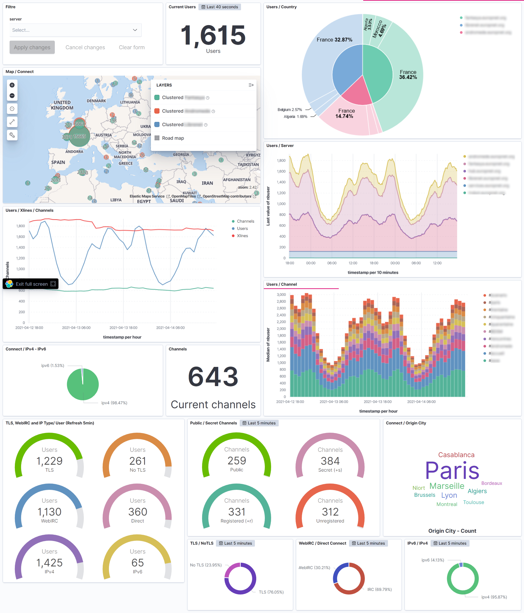

# Inspircd to ELK

This is a really **quick & dirty** repository to create some nice dashboard on Kibana from Inspircd logfile and data from the httpd_stats module.

### Prerequisites

* [httpd_stats](https://docs.inspircd.org/3/modules/httpd_stats/) module on inspircd v3 : *"this module provides XML-serialised statistics about the server, channels, and users over HTTP via the /stats path"*.
* Enable log file on inspircd.
* filebeat to send inspircd's logfile to logstash 
* xmlstarlet on the server that will be manipulating the xml file.
* A working elastic stack to get all the data and publish dashboards !

All path/ip/port/etc. information that must be changed are prefixed with *"<CHANGEME_"*.

### How to use this ?

* `filebeat/filebeat.yml` : file must be used on the ircd server to send the log file to logstash.
* `collect_xml/*.sh` : files must run on the elastic server to grab the xml data and format files correctly. I 
* `logstash/*.conf` : files must be placed on `/etc/logstash/conf.d`. It contains grok file to parse ircd logs, logstash rules and ruby code to parse xml files (ircd.conf for inspircd logfile, and inspircdstats.conf for xml files)
* `kibana/export.ndjson` : to create vizualisation and dashboard on kibana.

